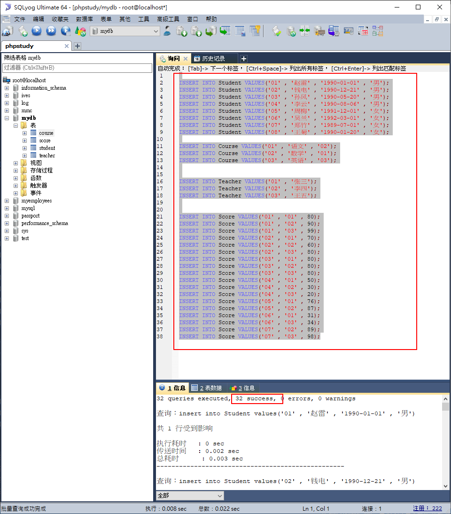
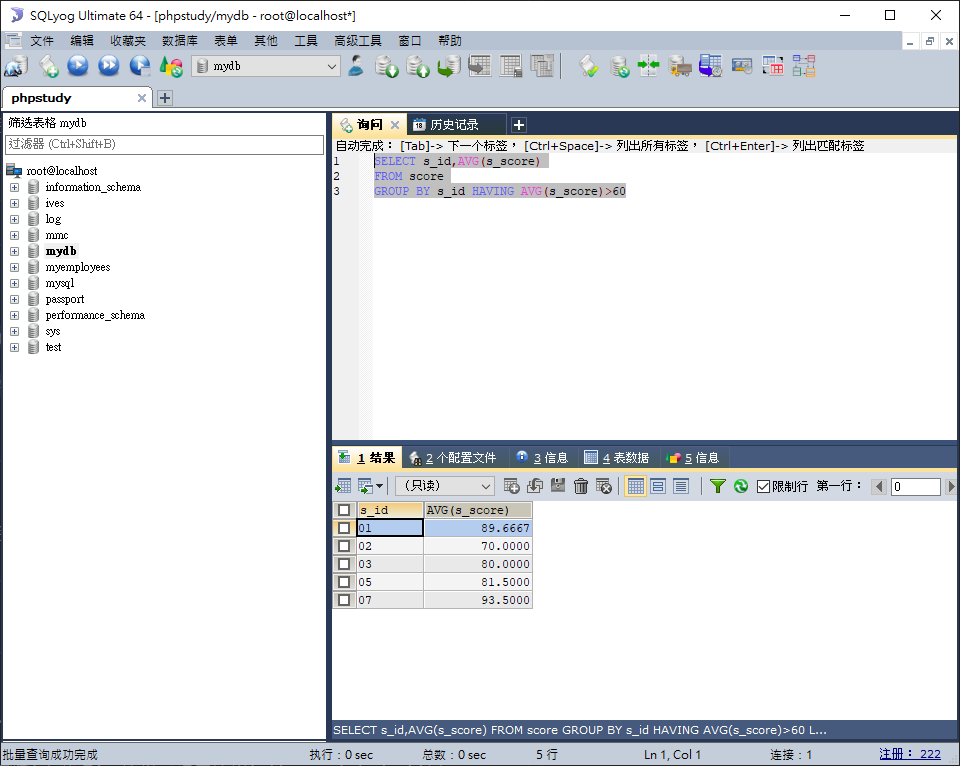

# MySQL 查表實作

# 新增測試數據

## 建立數據庫


## 建表

```sql
测试数据
--建表
--学生表
CREATE TABLE `Student`(
`s_id` VARCHAR(20),
`s_name` VARCHAR(20) NOT NULL DEFAULT '',
`s_birth` VARCHAR(20) NOT NULL DEFAULT '',
`s_sex` VARCHAR(10) NOT NULL DEFAULT '',
PRIMARY KEY(`s_id`)
);
--课程表
CREATE TABLE `Course`(
`c_id` VARCHAR(20),
`c_name` VARCHAR(20) NOT NULL DEFAULT '',
`t_id` VARCHAR(20) NOT NULL,
PRIMARY KEY(`c_id`)
);
--教师表
CREATE TABLE `Teacher`(
`t_id` VARCHAR(20),
`t_name` VARCHAR(20) NOT NULL DEFAULT '',
PRIMARY KEY(`t_id`)
);
--成绩表
CREATE TABLE `Score`(
`s_id` VARCHAR(20),
`c_id` VARCHAR(20),
`s_score` INT(3),
PRIMARY KEY(`s_id`,`c_id`)
);
```


## 插入測試數據

```sql
--插入学生表测试数据
insert into Student values('01' , '赵雷' , '1990-01-01' , '男');
insert into Student values('02' , '钱电' , '1990-12-21' , '男');
insert into Student values('03' , '孙风' , '1990-05-20' , '男');
insert into Student values('04' , '李云' , '1990-08-06' , '男');
insert into Student values('05' , '周梅' , '1991-12-01' , '女');
insert into Student values('06' , '吴兰' , '1992-03-01' , '女');
insert into Student values('07' , '郑竹' , '1989-07-01' , '女');
insert into Student values('08' , '王菊' , '1990-01-20' , '女');
--课程表测试数据
insert into Course values('01' , '语文' , '02');
insert into Course values('02' , '数学' , '01');
insert into Course values('03' , '英语' , '03');

--教师表测试数据
insert into Teacher values('01' , '张三');
insert into Teacher values('02' , '李四');
insert into Teacher values('03' , '王五');

--成绩表测试数据
insert into Score values('01' , '01' , 80);
insert into Score values('01' , '02' , 90);
insert into Score values('01' , '03' , 99);
insert into Score values('02' , '01' , 70);
insert into Score values('02' , '02' , 60);
insert into Score values('02' , '03' , 80);
insert into Score values('03' , '01' , 80);
insert into Score values('03' , '02' , 80);
insert into Score values('03' , '03' , 80);
insert into Score values('04' , '01' , 50);
insert into Score values('04' , '02' , 30);
insert into Score values('04' , '03' , 20);
insert into Score values('05' , '01' , 76);
insert into Score values('05' , '02' , 87);
insert into Score values('06' , '01' , 31);
insert into Score values('06' , '03' , 34);
insert into Score values('07' , '02' , 89);
insert into Score values('07' , '03' , 98);

```



# 四張表的關聯圖


# 查詢課程編號為"01"的課程比"02"的課程成績高的所有學生的學號(重點)

## 思路
- 使用到score、student表
- 先查詢score表中課程01的部分
- 再查詢score表中課程02的部分
- 將上述兩個查詢結果透過s_id作交集
- 最後再交集student表取得學生的姓名

## SQL語法

```sql
SELECT a.s_id "s_no",c.s_name,a.s_score "01",b.s_score "02" FROM
(
SELECT s_id,c_id,s_score FROM score WHERE c_id='01'
) AS a
INNER JOIN
(
SELECT s_id,c_id,s_score FROM score WHERE c_id='02'
) AS b ON a.s_id=b.s_id
INNER JOIN student AS c ON c.s_id=a.s_id
WHERE a.s_score>b.s_score
```

## 執行結果


# 查詢平均成績大於60分的學生的學號和平均成績

## SQL語法

```sql
SELECT s_id,AVG(s_score)
FROM score
GROUP BY s_id HAVING AVG(s_score)>60
```

## 執行結果



# 查詢所有學生的學號、姓名、選課數、總成績

## 思路

- 使用到student、score表
- 以學號作分組
- 學生有可能沒有成績(未選課)，所以這邊要使用left join(student)包含所有的學生，而不能使用inner join作交叉

## SQL語法

08同學未選課，所以會呈現NULL，加入一個case when判斷，當為空值時給予0

```sql
SELECT a.s_id,a.s_name,COUNT(b.c_id),
SUM(CASE WHEN b.s_score IS NULL THEN 0 ELSE b.s_score END) "sum"
FROM student AS a
LEFT JOIN score AS b ON a.s_id=b.s_id
GROUP BY s_id,a.s_name
```

## 執行結果


# 查詢姓王的老師的個數

## SQL語法

```sql
SELECT COUNT(DISTINCT t_name)
FROM teacher
WHERE t_name LIKE '王%'
```

## 執行結果


# 查詢"沒學過"張三老師課的學生的學號和姓名(重點)

## 思路

- 四張表都會使用到
- 先查詢"有學過"張三老師課的學生
    1. 找出張三老師的t_id
    2. 透過上述的t_id找到course表對應的c_id(找出張三老師開的課)
    3. 透過上述的c_id找到score表上對應的s_id(有成績的學生代表學過張三老師的課)
    4. 透過上述的s_id的查詢結果，找到studen表沒有對應s_id的結果(沒有對應的成績，代表沒學過張三老師的課)
## SQL語法

子查詢解法(子查詢效率較低)

```sql
SELECT s_id,s_name FROM student
WHERE s_id NOT IN(

SELECT s_id FROM score
WHERE c_id =(

SELECT c_id FROM course
WHERE t_id=(
SELECT t_id FROM teacher
WHERE t_name='张三'
)

)
)
```

聯表查詢解法(若數據過大的話，需制作暫時表，並優先使用條件篩選減少數據量再查詢)

```sql
SELECT s_id,s_name FROM student
WHERE s_id NOT IN
(
SELECT s_id FROM score AS s
INNER JOIN course AS c ON s.c_id=c.c_id
INNER JOIN teacher AS t ON c.t_id=t.t_id
WHERE t_name='张三'
)
```

錯誤判斷法(這樣查詢只會排除c_id=02的結果)

```sql
SELECT * FROM score
WHERE c_id!='02'
```

## 執行結果

子查詢


聯表查詢


# 查詢學過張三老師所教的所有課的同學的學號和姓名(重點)

## 思路

此測試數據庫的表都很小，所以可以直接作整張表的關聯，實際工作時的數據量都很大，大部分不會一次關聯這麼多張表，而是先作關聯1張表作成臨時表，再將此臨時表的結果再與其它表作關聯，而且在取臨時表時，可以的話會先將過濾的條件加上，使得查詢到的子結果數量變小，可以增加整體查詢的效率
## SQL語法

```sql
SELECT st.s_id,st.s_name,s.c_id,c.c_name,c.t_id,t.t_name
FROM student AS st
INNER JOIN score AS s ON s.s_id=st.s_id
INNER JOIN course AS c ON s.c_id=c.c_id
INNER JOIN teacher AS t ON t.t_id=c.t_id
WHERE t.t_name='张三'
ORDER BY st.s_id
```

## 執行結果


# 查詢學過編號為01的課程，並且也學過編號為02的課程的學生的學號和姓

## SQL語法

```sql
SELECT s_id,s_name FROM student
WHERE s_id IN
(
SELECT a.s_id FROM
(SELECT s_id FROM score WHERE c_id='01') AS a
INNER JOIN
(SELECT s_id FROM score WHERE c_id='02') AS b
ON a.s_id=b.s_id
)
```

## 執行結果


# 修改數據 語法記錄

修改學員的姓名，帶了條件
```sql
UPDATE `student` SET `name`='chichi' WHERE id=1;
```

不指定條件的情況下，會改動表中所有的數值
```sql
UPDATE `student` SET `name`='chichi';
```

```sql
UPDATE `student` SET `name`='ivesshe',`email`='ivesshe@gmail.com' WHERE id=1;
```